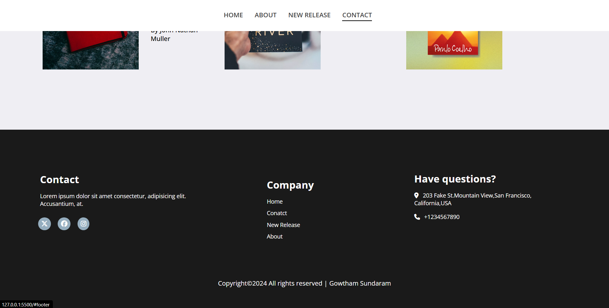

# 📚 SG Classic Publishers – Book Publishing Webpage

A **Book Publishing Company Webpage** built using **HTML5** and **CSS3**.  
This project showcases a clean, modern design with sections for company introduction, new releases, and contact details — perfect for demonstrating front-end layout and styling skills.

---

## 🚀 Features

- 🖼️ **Elegant Hero Section:** With background image and smooth text overlay  
- 📊 **Company Stats Section:** Displays readers, pages, and fans count  
- 🧾 **About Section:** Highlights company story with image and text layout  
- 📚 **New Releases Section:** Grid display of latest books with details  
- 📞 **Footer Section:** Includes contact info, quick links, and social media icons  
- 🎨 **Modern Styling:** Built entirely with custom CSS — no frameworks 

---

## 🧰 Technologies Used

- **HTML5** – Structure and semantic markup  
- **CSS3** – Styling, and Layout

---

## 📸 Preview

